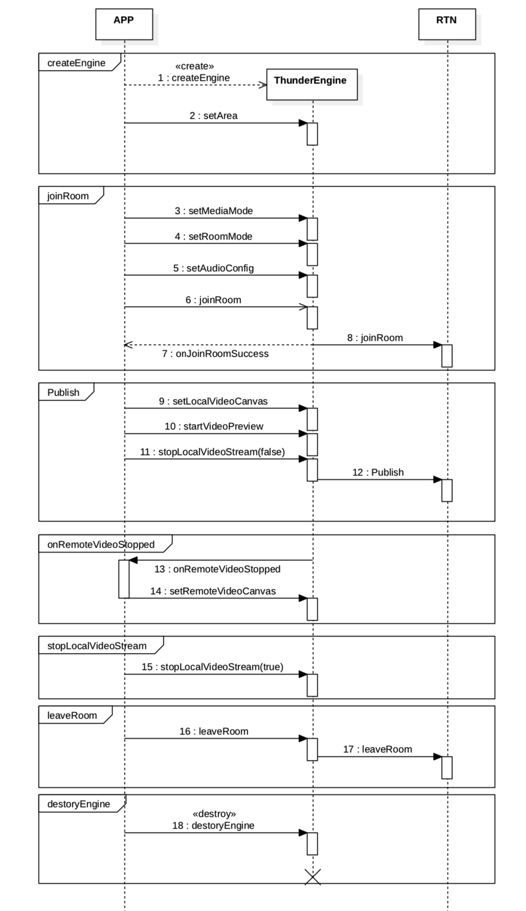

Please contact technical support for details # Real-Time Video Call

This section describes how to use basic functions of Thunder video SDK to implement video call. To have deeper understanding of the functions, refer to information about advanced functions or turn to access personnel for help.

## 1. Prerequisites

Before you start, ensure that the following are available:

- Visual Studio2015 or higher
- Valid AIVACOM account (valid APPID and APPSECRET). Please contact technical support for details 
- Windows device running Windows 7 or higher

## 2. Preparing the Development Environment

After the preceding prerequisites are met, SDK integration can be started.

### 2.1 Creating a Windows Project

1. Start Microsoft Visual Studio and click the option for creating a project.
2. The project creation window is displayed. Select MFC application program for project type. Enter the project name, select the project storage path, and click the confirmation option.
3. The MFC application program window is displayed. Select dialogue-based for application program type. Click Finish.

### 2.2 Integrating SDK

Integrate Thunder SDK to your project by referring to the following steps.

**Configuring project files**

- Based on the application scenario, obtain the latest SDK from [SDK Downloading](http://resource.sunclouds.com/AIVACOM_Thunderbolt_Windows_v2.7.3.zip) and open the SDK after decompressing the package.
- Copy the SDK folder from the downloaded package to your project folder.

**Configuring project attributes**

- Copy the provided header file and library file to the project directory.
- Add a header file directory for the project: Project - Attribute - Configuration Attribute - c/c++ - General - Additional Directory: Add the directory that stores header files
- Add a library directory referenced by the project: Project - Attribute - Configuration Attribute - Linker - General - Additional Library Directory: Add the directory that stores library files.
- Add a library file referenced by the project: Project - Attribute - Configuration Attribute - Linker - Input - Additional Dependent Items: Add the library file name.
- Copy the provided dll file to the project output directory.

## 3. Implementing Real-Time Video Call

This section describes how to implement real-time audio/video call. The following figure shows the time sequence of API calling during a video call:



### 3.1 Creating User Interface

Create user interface (UI) of audio/video call for your project as required by the scenario. If a UI is present, check and initialize IThunderEngine.

If you want to implement a video call, you are advised to add the following UI elements:

- Local video window
- Remote video window
- Button for stopping a call

### 3.2 Initializing IThunderEngine

Before calling APIs, create and initialize the IThunderEngine object.

Fill in the APPID of the project in this step.

Call [createEngine](../api/Windows/v2.7.0/function.html#ithunderenginecreateengine) and [initialize](../api/Windows/v2.7.0/function.html#ithunderengineinitialize). Obtain APPID and initialize [IThunderEngine](../api/Windows/v2.7.0/function.html#ithunderengine).

You can also register callback events that you want to monitor during initialization as required by the scenario, for example, local users joining the channel or decoding the video start frame of remote users.

```c++
int ThunderManager::init(const char* appId, int sceneId, IThunderEventHandler* pHandler)
{
  if (m_pThunderEngine != NULL)
  {
    m_pThunderEngine = createEngine();
    return m_pThunderEngine->initialize(appId, sceneId, pHandler);
  }
}
```

```c++
// Inherit IThunderEventHandler and implement callback interface.
// For example, the following important callbacks:

// This callback will be triggered when a local user joins channel successfully.
virtual void onJoinRoomSuccess(const char* roomId, const char* uid, int elapsed) = 0;

// This callback will be triggered when a local user leaves channel successfully.
virtual void onLeaveRoom() = 0;

// It can be determined according to stop whether there is a video stream on the remote, and the setRemoteVideoCanvas method can be called to set remote view
virtual void onRemoteVideoStopped(const char* uid, bool stop) = 0;
```

### 4.4 Joining a Room

After creating and initializing SDK, call [joinRoom](../api/Windows/v2.7.0/function.html#ithunderenginejoinroom) to join a room. After you enter a room successfully, you will receive the [onJoinRoomSuccess](../api/Windows/v2.7.0/notification.html#ithundereventhandleronjoinroomsuccess) callback. Following are the detailed steps:

```c++
virtual int joinRoom(const char* token, int tokenLen, const char* roomId, const char* uid) = 0;
```

Obtain token from the joinRoom method. For details, see [Generating Token](../token_generator/token_generator.md).

### 3.3 Concurrently Sending Audio/Video Streams in Local View

After entering a room, you can start the local view upon receiving the onJoinRoomSuccess notification.

Obtain the camera device.

```c++
// Get camera device
void CJLYMeetDlg::initVideoDevices()
{
  VideoDeviceList videoDevList;

  if (MediaManager::instance()->getThunderManager()->getVideoDeviceMgr() != NULL)
  {
    // Get camera list
    MediaManager::instance()->getThunderManager()->getVideoDeviceMgr()->enumVideoDevices(videoDevList);
    for (int i = 0; i < videoDevList.count; ++i)
    {
      wchar_t wname[1024] = { 0 };
      MultiByteToWideChar(CP_UTF8, 0, videoDevList.device[i].name, -1, wname, _countof(wname));
      m_videoDevicesCombo.InsertString(i, wname);
      m_videoDevicesCombo.SetCurSel(0);
    }
  }
}
```

```c++
// Set local camera, m_videoDevicesCombo.GetCurSel() is to get serial number of the device selected by the current control
int index = m_videoDevicesCombo.GetCurSel();
index = (int)m_videoDevicesCombo.GetItemData(index);
MediaManager::instance()->getThunderManager()->getVideoDeviceMgr()->startVideoDeviceCapture(index);

//Set local view, refer to VideoCanvas for specific parameters
VideoCanvas canvas;
canvas.renderMode = VIDEO_RENDER_MODE_CLIP_TO_BOUNDS;
sprintf_s(canvas.uid, "%I64d", m_localUid);
canvas.hWnd = m_videoCanvs[0].m_videoCavas->GetSafeHwnd();
MediaManager::instance()->getThunderManager()->setLocalVideoCanvas(canvas);

//Set encoding configuration, refer to VideoEncoderConfiguration for specific parameters
VideoEncoderConfiguration config;
config.playType = VIDEO_PUBLISH_PLAYTYPE_SINGLE;
config.publishMode = VIDEO_PUBLISH_MODE_SMOOTH_DEFINITION;
MediaManager::instance()->getThunderManager()->setVideoEncoderConfig(config);

// Open preview
MediaManager::instance()->getThunderManager()->startVideoPreview();
//Send local video
MediaManager::instance()->getThunderManager()->stopLocalVideoStream(false);
//Send audio/video
MediaManager::instance()->getThunderManager()->stopLocalAudioStream(false);
```

After performing the preceding steps, you can start local view now. For detailed information, see descriptions about [joinRoom](../api/Windows/v2.7.0/function.html#ithunderenginejoinroom), [getVideoDeviceMgr](../api/Windows/v2.7.0/function.html#ithunderenginegetvideodevicemgr), [startVideoDeviceCapture](../api/Windows/v2.7.0/function.html#ivideodevicemanagerstartvideodevicecapture), [setLocalVideoCanvas](../api/Windows/v2.7.0/function.html#ithunderenginesetlocalvideocanvas), [setVideoEncoderConfig](../api/Windows/v2.7.0/function.html#ithunderenginesetvideoencoderconfig), [startVideoPreview](../api/Windows/v2.7.0/function.html#ithunderenginestartvideopreview) in API Document.

### 3.4 Remote View

If a user enters the room and calls stopLocalVideoStream, other users in the room will receive the [onRemoteVideoStopped](../api/Windows/v2.7.0/notification.html#ithundereventhandleronremotevideostopped) notification. The video stream status of remote users can be determined by checking the stop attribute.

```c++
virtual void onRemoteVideoStopped(const char* uid, bool stop) = 0;
```

If a user enables video streams, call setRemoteVideoCanvas by referring to the following instructions:

```c++
void CJLYMeetDlg::setRemoteVideoCanvas(__int64 uid, HWND hwnd)
{
  //Set remote view, refer to VideoCanvas for specific parameters
  VideoCanvas canvas;
  canvas.renderMode = VIDEO_RENDER_MODE_CLIP_TO_BOUNDS;
  sprintf_s(canvas.uid, "%I64d", uid);
  canvas.hWnd = hwnd;
  //Set remote view
  MediaManager::instance()->getThunderManager()->setRemoteVideoCanvas(canvas);
}
```

For detailed information, see descriptions about [setRemoteVideoCanvas](../api/Windows/v2.7.0/function.html#ithunderenginesetremotevideocanvas) in API Document.

### 3.5 Leaving a Room

To stop a call, call [leaveRoom](../api/Windows/v2.7.0/function.html#ithunderengineleaveroom) to leave the current room.

To disable the app, call [leaveRoom](../api/Windows/v2.7.0/function.html#ithunderengineleaveroom) to leave the current room and call [destroyEngine](../api/Windows/v2.7.0/function.html#ithunderenginedestroyengine) to destroy the IThunderEngine object so as to avoid memory leak.

## 4 Running a Project

Run the project on the Windows device. After a video call is established successfully, you will be displayed with both local an remote views.

## 5. API Reference

- [createEngine](../api/Windows/v2.7.0/function.html#ithunderenginecreateengine)
- [initialize](../api/Windows/v2.7.0/function.html#ithunderengineinitialize)
- [setArea](../api/Windows/v2.7.0/function.html#ithunderenginesetarea)
- [joinRoom](../api/Windows/v2.7.0/function.html#ithunderenginejoinroom)
- [getVideoDeviceMgr](../api/Windows/v2.7.0/function.html#ithunderenginegetvideodevicemgr)
- [startVideoDeviceCapture](../api/Windows/v2.7.0/function.html#ivideodevicemanagerstartvideodevicecapture)
- [setLocalVideoCanvas](../api/Windows/v2.7.0/function.html#ithunderenginesetlocalvideocanvas)
- [setVideoEncoderConfig](../api/Windows/v2.7.0/function.html#ithunderenginesetvideoencoderconfig)
- [startVideoPreview](../api/Windows/v2.7.0/function.html#ithunderenginestartvideopreview)
- [stopVideoPreview](../api/Windows/v2.7.0/function.html#ithunderenginestopvideopreview)
- [stopLocalVideoStream](../api/Windows/v2.7.0/function.html#ithunderenginestoplocalvideostream)
- [setRemoteVideoCanvas](../api/Windows/v2.7.0/function.html#ithunderenginesetremotevideocanvas)
- [leaveRoom](../api/Windows/v2.7.0/function.html#ithunderengineleaveroom)
- [destroyEngine](../api/Windows/v2.7.0/function.html#ithunderenginedestroyengine)

## 6. Precautions

- The callback method in the event processing method IThunderEventHandler is included in the asynchronous thread. Try not to perform UI operations internally but use methods similar to ::PostMessage.